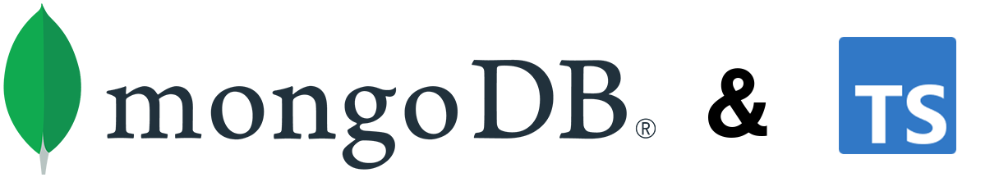

# Project Overview

This project is a CRUD   use MongoDB and express  with TypeScript. It is a simple application that allows you to create, read, update, and delete users.  The application is built with Node.js, Express, MongoDB, and TypeScript.  

# Features

- Create a product item
- Read a product item
- Update a product item
- Delete a product item


## Getting Started

## Prerequisites

- [Node.js](https://nodejs.org/en/)
- [MongoDB](https://www.mongodb.com/)
- [MongoDB Compass](https://www.mongodb.com/products/compass) (optional)

## Installation

1. Clone the repository to your local machine

```bash

git clone  : https://github.com/Clifftech123/product-Items-api.git
    
 ```

2. Install dependencies

```bash

npm install
    
 ```

3. Start the application

```bash

npm run  start
    
 ```

4. Open the application in your browser


```bash

http://localhost:3000/products
    
  ```


## Usage

### Create a product item

```bash

POST  : http://localhost:3000/products
    
  ```
  You can use Postman to test the API endpoints. The request body should be in JSON format.

  use the following JSON format to create a product item

  ```json

{
    "name": "product name",
    "description": "product description",
    "price": 1000,
     "category": " product category"
}
    
  ```


### Read a product item
    
 ```bash

GET  : http://localhost:3000/products

GET  : http://localhost:3000/products/:id

```

### Update a product item

```bash


PUT  : http://localhost:3000/products/:id

```


### Delete a product item

```bash

DELETE  : http://localhost:3000/products/:id

```


## Built With

- [Node.js](https://nodejs.org/en/)
- [Express](https://expressjs.com/)
- [MongoDB](https://www.mongodb.com/)
- [Mongoose](https://mongoosejs.com/)
- [TypeScript](https://www.typescriptlang.org/)


